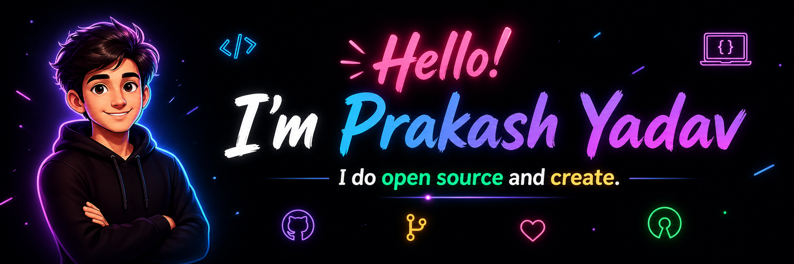

<div align="center">
  <a href="https://github.com/TheRawon">
    
  </a>
</div>

<br />

<div align="center">

# Prakash Yadav


<br />
<br />


<p>
  Full stack developer focused on building fast, scalable, and user-friendly web applications
  with clean backend architecture and polished frontend experiences.
</p>

<p>
  <a href="https://www.instagram.com/daredevil_prakash/">
    
  </a>
  <a href="https://www.facebook.com/prakash.yadav.5817300">
    
  </a>
  <a href="https://www.linkedin.com/in/prakash-yadav-3096a5309/">
    
  </a>
</p>

</div>

---

## Professional Summary

<table>
  <tr>
    <td width="56%" valign="top">

- Build full stack web applications from idea to deployment
- Strong with `PHP`, `Laravel`, `MySQL`, `HTML`, `CSS`, and `JavaScript`
- Focused on clean code, performance, scalability, and maintainability
- Interested in modern UI, API design, authentication, and system architecture
- Continuously improving across both backend and frontend engineering

  </td>
    <td width="44%" valign="top">

```php
class DeveloperProfile
{
    public string $name = 'Prakash Yadav';
    public string $role = 'Full Stack Developer';
    public array $stack = ['PHP', 'Laravel', 'JavaScript', 'MySQL'];
    public array $strengths = ['APIs', 'UI', 'Performance', 'Architecture'];
    public string $approach = 'Build clean, scalable, user-focused products';
}
```

  </td>
  </tr>
</table>

---

## Core Focus

<div align="center">
  
  
  
  
</div>

---

## Tech Stack

### Languages and Frameworks

<div align="center">
  
  
  
  
  
  
  
</div>

<br />

### Tools I Work With

<div align="center">
  
</div>

---

## What I Build

<table>
  <tr>
    <td width="33%" valign="top">

### Web Apps

- Business websites
- Admin dashboards
- CRUD systems
- Responsive interfaces

  </td>
    <td width="33%" valign="top">

### Backend Systems

- REST APIs
- Authentication flows
- Database design
- Role-based access

  </td>
    <td width="33%" valign="top">

### Engineering Goals

- Clean architecture
- Better performance
- Reusable components
- Smooth user experience

  </td>
  </tr>
</table>

---

## GitHub Insights

<div align="center">
  
  
</div>

<br />

<div align="center">
  
</div>

<br />

<!-- <div align="center">
  
</div> -->

---

## Contribution Graph

<div align="center">
  
</div>

---

## Philosophy

<div align="center">
  <h3>Build products that are clean in code, clear in design, and reliable in real use.</h3>
</div>
